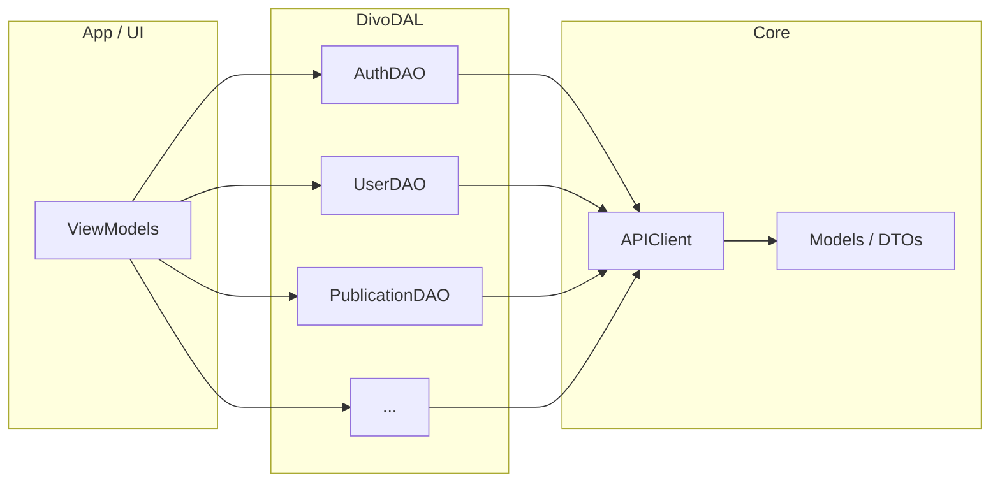

# Divo DAL Layer with DAOs for REST API

## Context

- **API**: [openapi.yaml](openapi.yaml) describes the Divo API (OpenAPI 3.0.3): base path `/api`, Bearer JWT auth, ~120 endpoints across **24 tags** (Auth, User, Publication, Event, File, Agency, Agency Employee, Customer, Geo, Feedline, Follower, Favorite, User Gallery, Social Network, User Social Network, Messenger, Dictionary, User Geoposition, Radar, Wallet, User Paid Services, NFT, Banners, System, Crypto).
- **Project**: Bazel-built Telegram-iOS fork (bundle `app.divo.fashion`). New code uses Swift ([CLAUDE.md](CLAUDE.md)); submodules use `swift_library`. No existing Divo-specific networking layer.
- **Constraint**: The spec defines almost no request/response schemas (only `Error`: `message`, `errors`). DTOs will be either generic (e.g. `[String: Any]` / `Codable` with flexible types) or refined later when real payloads are known.

## Architecture

- **APIClient**: Single entry for HTTP: base URL `https://backend.divo.fashion/api`, `URLSession`, injectable Bearer token, JSON encode/decode, error mapping (401/403/422 → typed errors using `Error` schema).
- **DAOs**: One type per API tag, each exposing methods that map 1:1 to the spec’s paths (e.g. `AuthDAO.login(email:password:deviceId:deviceType:)` → `POST /auth/login`). DAOs call `APIClient` and return decoded models or throw.
- **Models**: Shared DTOs for requests/responses. Start with a small set (e.g. auth request/response, user info, list wrappers) and `Codable` where possible; keep optional/dictionary for unspecified bodies so the app can evolve without blocking on full schema.

## Implementation Plan

### 1. New submodule: `submodules/DivoDAL/`

Create a Swift library that will contain:

- `**Sources/**`
  - **Core/**
    - `APIClient.swift` – base URL, `URLSession`, `request(_:method:path:query:body:token:)`, response handling, status-code → `DivoAPIError` (unauthorized, forbidden, validation with `message`/`errors`).
    - `APIEndpoint.swift` – type-safe path + method enum or struct per tag (optional; alternatively paths as strings in DAOs).
  - **Models/**
    - `AuthModels.swift` – e.g. `LoginRequest`, `LoginResponse` (accessToken, etc.) from openapi.yaml where specified; generic body type for unspecified.
    - `UserModels.swift` – minimal (e.g. user id, email) plus placeholder for `/user/info` response.
    - `CommonModels.swift` – `APIError` (message, errors), pagination/list wrappers if used.
  - **DAO/**
    - `AuthDAO.swift` – login, logout, registration, registration-social, login-social, send-email-code, confirm-email, confirm-code, reset-password, find-user.
    - `UserDAO.swift` – info, rating, available-rating-features, viewers, budge-count, get by id, update-profile, update-password, update-email, update-email-confirm, list-with-wallets, save-push-token, send-test-push, delete-account, change-role.
    - Additional DAOs by tag: `PublicationDAO`, `EventDAO`, `FileDAO`, `AgencyDAO`, `AgencyEmployeeDAO`, `CustomerDAO`, `GeoDAO`, `FeedlineDAO`, `FollowerDAO`, `FavoriteDAO`, `UserGalleryDAO`, `SocialNetworkDAO`, `UserSocialNetworkDAO`, `MessengerDAO`, `DictionaryDAO`, `UserGeopositionDAO`, `RadarDAO`, `WalletDAO`, `UserPaidServicesDAO`, `NFTDAO`, `BannersDAO`, `SystemDAO`. Crypto webhook can be a small `CryptoDAO` (no auth) if the app needs it.
- `**BUILD**` – single `swift_library` (e.g. `name = "DivoDAL"`, `module_name = "DivoDAL"`), `visibility = ["//visibility:public"]`, no external deps beyond Foundation (and optionally a minimal JSON helper if needed).

### 2. API client design (concrete)

- **Base URL**: `https://backend.divo.fashion` with path prefix `/api` (e.g. request to `baseURL + "/api" + path`).
- **Auth**: Optional `authToken: String?` (e.g. set on APIClient or per-request); when present, add header `Authorization: Bearer <token>`.
- **Content types**: `application/json` for JSON bodies; multipart for `/file/upload-file` and `/file/upload-files` (and any other multipart endpoints).
- **Errors**: Parse 401/403/422 body as `Error` schema; expose as `DivoAPIError.unauthorized`, `.forbidden`, `.validation(message: String?, errors: [String: Any]?)`; non-2xx without body as `.serverError(statusCode: Int)`.

### 3. DAO method pattern

- Each method corresponds to one OpenAPI operation.
- Parameters: path params (e.g. `id`, `walletId`, `thread`) and, where specified, body/query. Use Swift types (Int, String, Encodable structs).
- Return: `async throws` with decoded response type (e.g. `LoginResponse`) or a generic `Codable`/dictionary for unspecified responses.
- Example: `AuthDAO.login(email: String, password: String, deviceId: String, deviceType: String) async throws -> LoginResponse`.

### 4. Bazel integration

- Add `//submodules/DivoDAL:DivoDAL` to the `deps` of any target that will call the Divo API (e.g. `Telegram/Lib` or a dedicated Divo feature module when introduced). Not required to be in the main app’s initial dependency tree until a feature uses it.

### 5. OpenAPI coverage and DTOs

- **Auth**: Request/response bodies are partly described (e.g. login: email, password, deviceId, deviceType; response: accessToken). Define `LoginRequest`, `LoginResponse`, and similar for registration/confirm-email/reset-password where the spec is clear.
- **Other domains**: For endpoints with `schema: { type: object }` only, use a generic body (e.g. `[String: Any]` encoded to JSON, or a minimal `Encodable` struct that can be extended) and document that response types can be refined when backend contracts are fixed. This keeps the DAL complete and buildable without blocking on full schema.

### 6. File layout (summary)

| Path                                                   | Purpose                                                 |
| ------------------------------------------------------ | ------------------------------------------------------- |
| `submodules/DivoDAL/BUILD`                             | Bazel `swift_library` for DivoDAL                       |
| `submodules/DivoDAL/Sources/Core/APIClient.swift`      | HTTP client, base URL, auth, errors                     |
| `submodules/DivoDAL/Sources/Core/APIEndpoint.swift`    | Optional path/method constants                          |
| `submodules/DivoDAL/Sources/Models/CommonModels.swift` | APIError, generic wrappers                              |
| `submodules/DivoDAL/Sources/Models/AuthModels.swift`   | Auth DTOs                                               |
| `submodules/DivoDAL/Sources/Models/UserModels.swift`   | User DTOs                                               |
| `submodules/DivoDAL/Sources/DAO/AuthDAO.swift`         | Auth endpoints                                          |
| `submodules/DivoDAL/Sources/DAO/UserDAO.swift`         | User endpoints                                          |
| `submodules/DivoDAL/Sources/DAO/PublicationDAO.swift`  | Publication endpoints                                   |
| …                                                      | One DAO file per remaining tag (Event, File, Agency, …) |

### 7. Naming and style

- **Naming**: PascalCase for types (e.g. `AuthDAO`, `LoginRequest`), camelCase for methods and variables ([CLAUDE.md](CLAUDE.md)).
- **Documentation**: Brief comments for public API (APIClient, each DAO protocol or class, and main request/response types).

### 8. Out of scope for this plan

- Token storage/refresh (caller provides token to APIClient).
- Caching or offline support (DAL remains a thin remote API layer).
- Code generation from openapi.yaml (manual DAOs and models to match existing code style and Bazel setup).

## Deliverables

1. New `submodules/DivoDAL/` with BUILD and Swift sources as above.
2. **APIClient** with configurable base URL and auth token, JSON and multipart support, and `DivoAPIError`.
3. **Models** for Auth (and User where obvious); generic/placeholder for unspecified schemas.
4. **DAOs** for all 24 tags, each with methods for the endpoints listed under that tag in [openapi.yaml](openapi.yaml).
5. Wiring of `DivoDAL` into the app’s dependency graph when a feature first needs it.

## Verification

- Build: `bazel build //submodules/DivoDAL:DivoDAL`.
- Optionally add a small integration test or example that performs one unauthenticated call (e.g. `GET /dictionary/gender` or `POST /auth/login` with dummy data) to validate client and parsing; can be a separate test target or manual run.

