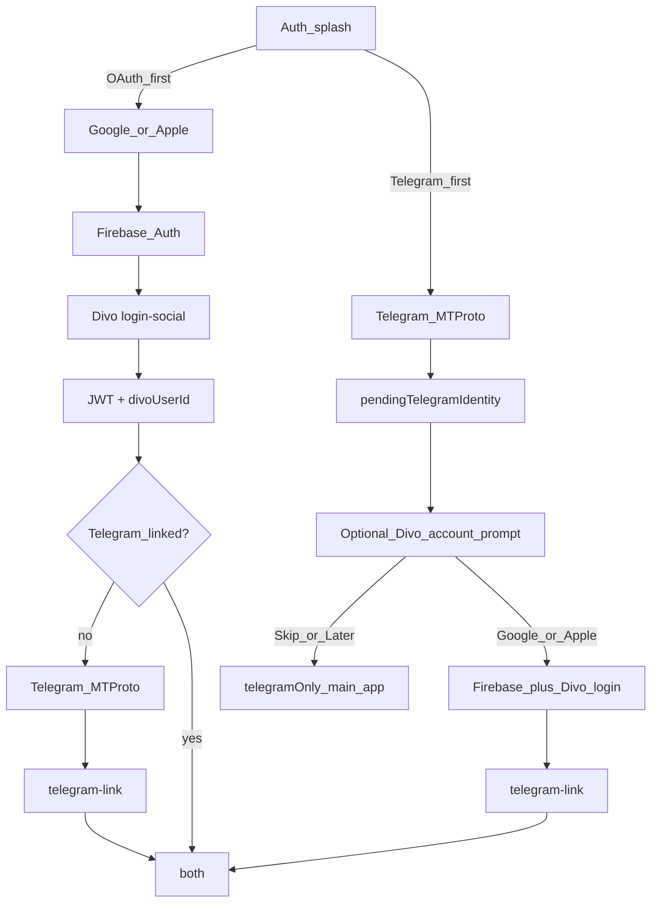

# Combined auth: OAuth or Telegram first → Divo API + link (Scenario C)

## Goal

Two **equal entry options** on the auth splash. **Full Divo + Telegram** (`both`) still requires Divo JWT and `telegram-link`; **Telegram-first** may stop after MTProto without OAuth.

| Path | Order | Typical end state |
|------|--------|-------------------|
| **A — OAuth first** | Google/Apple → Divo JWT → (optional) Telegram MTProto → `telegram-link` | `both` (or `divoOnly` if user skips Telegram) |
| **B — Telegram first** | Telegram MTProto → **optional** Google/Apple → Divo JWT → `telegram-link` | `telegramOnly` **or** `both` |

Shared rules:

- Divo: Firebase Auth → `POST /auth/login-social` / `registration-social` → `accessToken` + `divoUserId` (only when user chooses OAuth).
- Telegram: **real** MTProto (`auth.signIn` / code / 2FA), not production `divoCompleteAuthorization`.
- Link: `POST /auth/telegram-link` with **Bearer** + `divoUserId` + `telegramUserId` (+ `phone`) — only after OAuth in Path B (or Path A).

---

## Auth states (`DivoAuthCoordinator`)

| State | Divo JWT | Telegram MTProto | User can use |
|-------|----------|------------------|--------------|
| `loggedOut` | no | no | Auth screens |
| `divoOnly` | yes | no | Divo features; **Connect Telegram** (Path A) |
| `telegramOnly` | no | yes | **Chats / channels / stories** (Path B after Skip); Divo screens gated |
| `telegramPending` | no | yes | **Optional** transient: Telegram done, Divo prompt visible (OAuth not yet chosen/skipped) |
| `both` | yes | yes | Full app |

**Path A (OAuth → Telegram):** `loggedOut` → `divoOnly` → `both` when user connects Telegram.

**Path B (Telegram → optional OAuth):**

- `loggedOut` → `telegramPending` (brief: show prompt) → **`telegramOnly`** if user taps **Skip** / **Later** → enter main app (chats).
- `telegramPending` → OAuth → `linkTelegram` → **`both`** if user completes Google/Apple.
- User may upgrade **`telegramOnly` → `both`** later from Settings / profile via same OAuth + link flow (pending stash restored from current Telegram session).

Coordinator: `AuthEntryPoint` = `.oauthFirst` | `.telegramFirst`.

**Pending stash:** `PendingTelegramLink { telegramUserId, phone?, accountRecordId }` — retained in Path B until link succeeds or logout; cleared on Skip only if product chooses not to auto-link later (recommend **keep stash** on Skip so in-app “Link Divo account” can link without re-auth Telegram).

---

## Divo API contracts

### A. Social login

- `POST /auth/login-social` / `POST /auth/registration-social`  
- Body: `{ firebaseToken, deviceId, deviceType }` (+ `role` / `timezone` for registration)  
- Response: `{ accessToken, user: { id: divoUserId } }`

### B. Telegram link

**Auth:** `Authorization: Bearer <accessToken>`  
**Body:** `{ divoUserId, telegramUserId, phone?, deviceId, deviceType }`

- Path A: after Telegram when `divoOnly`.  
- Path B: only after user **opts in** to OAuth (not required for `telegramOnly` entry).

Update [`openapi.yaml`](openapi.yaml).

---

## Client architecture

### 1. Firebase Auth

Unchanged; invoked only when user starts Google/Apple (Path A entry, or Path B optional step).

### 2. `DivoAuthCoordinator`

- `onTelegramAuthorized` when `entryPoint == .telegramFirst`:  
  - If `divoUserId != nil` (edge: OAuth before Telegram) → `linkTelegram` → `both`  
  - Else → set `pendingTelegram`, show **optional** Divo prompt; do **not** block Telegram main UI after Skip  
- `skipDivoLinkAfterTelegram()` → state `telegramOnly`, dismiss auth, `canEnterMainApp = true` (chats)  
- `signInWithGoogle()` / `signInWithApple()` when `pendingTelegram != nil` → Divo login → `linkTelegram` → `both`  
- `signInWithGoogle()` / `signInWithApple()` when no pending → Path A behavior (`divoOnly`)  
- `canEnterMainApp`: `telegramOnly` **or** `both` (not `divoOnly` alone unless product gates)  
- `upgradeToDivoAccount()`: from `telegramOnly`, run OAuth + link using live Telegram session + stash  
- In-app: Divo tabs show “Sign in to Divo” CTA when `telegramOnly`

### 3. Authorization UI — dual entry splash

**Entry:**

- Google / Apple → `entryPoint = .oauthFirst`  
- Continue with phone → `entryPoint = .telegramFirst` → MTProto flow  

**Path A:** unchanged (OAuth → optional Connect Telegram).

**Path B (updated):**

- After Telegram success: **non-blocking** sheet / screen — **Complete your Divo account**  
  - Primary: Continue with Google / Apple  
  - Secondary: **Skip** or **Later** → main app as `telegramOnly` (chats unlocked)  
- No forced modal that blocks Telegram indefinitely  
- Settings / profile: **Link Divo account** when `telegramOnly` (reuses OAuth + link)

**Debug:** `divoCompleteAuthorization` behind `DivoConfig.isDebugEnabled` only.

### 4. TelegramCore hook

1. `AuthorizedAccountState` + `switchToAuthorizedAccount`  
2. `DivoAuthCoordinator.onTelegramAuthorized` — Path B does **not** require OAuth before `authorizationCompleted()`  
3. `authorizationCompleted()` may fire on `telegramOnly` for Path B Skip (product: enter Telegram shell immediately)

`TelegramCore` → `DivoCore` in BUILD.

### 5.–6. API client, logout

- `DivoAPIClient`: no Bearer when `telegramOnly` (Divo calls fail or mock until linked).  
- Logout: clear Divo + pending + Firebase + Telegram as today.

---

## Security notes

| Topic | Guidance |
|-------|----------|
| Path B Skip | User has Telegram only; no Divo JWT — Divo REST must reject unauthenticated calls |
| Path B OAuth later | Same `telegram-link` rules when user opts in |
| Stash on Skip | Keep `telegramUserId` for later link; do not send MTProto secrets to Divo |
| Release | Remove hardcoded debug tokens from production |

---

## Testing plan

| Case | Expected |
|------|----------|
| Path A: OAuth → Connect Telegram | `divoOnly` → `both` |
| Path B: Telegram → Skip | `telegramOnly`; main app chats work; Divo gated |
| Path B: Telegram → OAuth | `both` after link |
| Path B: `telegramOnly` → Link Divo later | OAuth + link → `both` |
| Path B: Skip then OAuth from prompt | Same as above |
| Path A: OAuth, skip Telegram | `divoOnly` if product allows |
| Logout from any state | All layers cleared |
| Debug bypass | `divoCompleteAuthorization` when debug flag on |

---

## Implementation order

1. **Backend:** Social login + `telegram-link`  
2. **Firebase Auth** SDK  
3. **DivoCore:** Coordinator — `telegramOnly`, optional Path B, `skipDivoLinkAfterTelegram`, upgrade path  
4. **AuthorizationUI:** Dual splash; Path B prompt with **Skip/Later**; non-blocking entry to chats  
5. **TelegramCore:** Allow `authorizationCompleted` on Path B Skip  
6. **QA:** Path A matrix + Path B Skip / OAuth / upgrade-later  

---

## Out of scope

- Push / FCM / `save-push-token`  
- Email/password as primary (fallback on OAuth prompt)  
- Phone-only Divo account without OAuth  
- `auth.exportLoginToken` validation (phase 2)  
- DivoDAL consolidation (optional)
